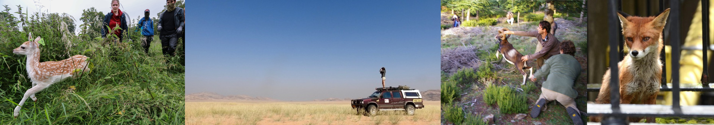

{fig-align="center"}

::: {style="text-align: justify;"}
**Work With Us**  
If you are interested in joining our team or collaborating on a project, please contact Simone Ciuti to discuss current opportunities and possibilities:  
*Simone Ciuti simone.ciuti "at" ucd.ie*  
*Associate Professor of Wildlife Biology*  
*O'Brien Centre for Science*  
*Belfield Campus in Dublin 4, Dublin, Ireland*

{fig-align="center"}

**Media & Stakeholder Engagement**      
We are committed to sharing our research beyond the academic community. We speak regularly with the media and deliver seminars at local, national, and international levels.  

Below are some examples of the media coverage our research has received:  
{fig-align="center"}

If you are a member of the media or a professional stakeholder:  
- Contact us to discuss our latest findings.  
- Request a briefing: We can arrange a call, a formal seminar, or a webinar to share the news and impact of our research with your organization or audience.

:::

::: {style="text-align: justify;"}
**We are grateful for the invaluable support from the following funders:**  
- Irish Department of Agriculture, Food, and the Marine (DAFM)  
- University College Dublin  
- Research Ireland (formely SFI & IRC)  
- Office of Public Works (OPW)   
- EU Interreg  
- Giraffe Conservation Foundation  
- British Deer Society  
- Mammal Conservation Trust  
- Dublin City Council  
- ATC-Massa Tuscany   
- Animal Society for Animal Behaviour ASAB  
- Mueller-Fahneberg-Stiftung  
- Deutche Bundesstiftung Umwelt  
- Verbans der Freunde der Universitaet  
- Alberta Conservation Foundation  
- Canada Parks  
- Alberta Conservation Association  
- Emeral awards  
- NSERC-CRSNG Canada  
- Shell limited Canada  
- Regione Toscana, Italy  
- MIUR Italy  
- Regione Sardegna, Italy  
- European Social Fund  
- Fondazione del Banco di Sardegna  
- Por Sardegna EU  
- University of Alberta  
- North Dakota Game and Fish Department  
- NGO Instituto Araguaia  
- Adolf Haeuser-Stiftung foundation  
- GFC German Research Foundation  
:::
