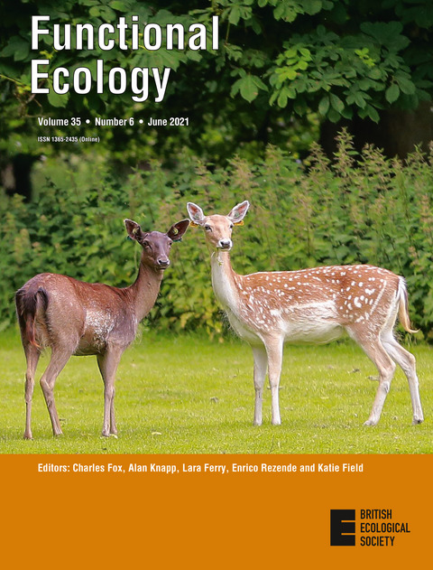
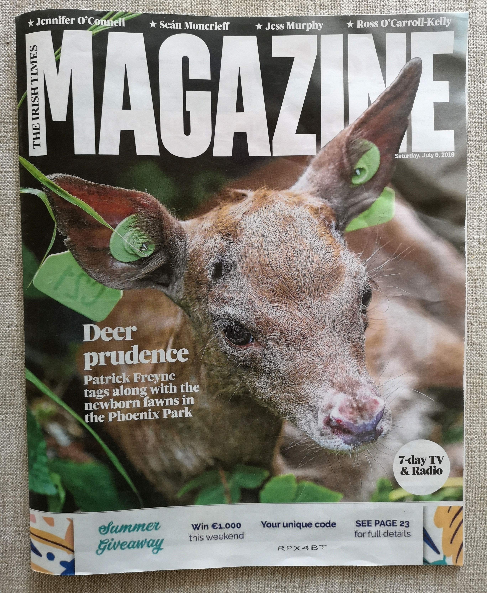
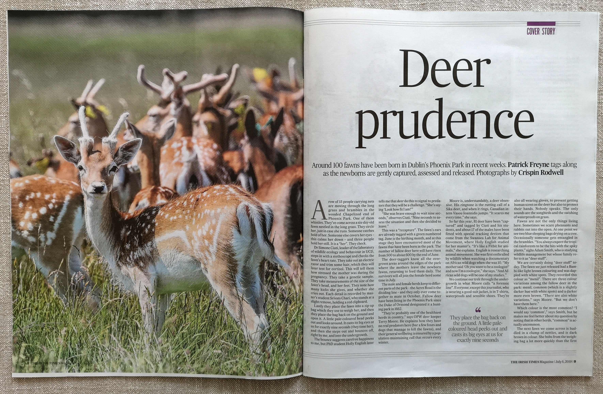

::: {.columns}

::: {.column width="20%"}

:::

::: {.column width="20%"}

:::

::: {.column width="20%"}

:::

::: {.column width="20%"}

:::

::: {.column width="20%"}

:::

:::

## Journal Articles

::: {.nocite}
@*
:::